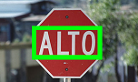

<h1 align="center">
    
</h1>

<h4 align="center">
  	🦅 Detector de texto em imagens enviadas para processamento
</h4>

<p align="center">
	<a href="#-tecnologia">Tecnologias</a>&nbsp;&nbsp;&nbsp;|&nbsp;&nbsp;&nbsp;
	<a href="#instalação">Instalação</a>
</p>

## 🤖 Tecnologias
- [Django](https://www.djangoproject.com/)
- [OpenCV](https://opencv.org/)

## 💻 Descrição
**Detector de texto em imagem, usando EAST Text Detector, depois de submetida em um formulário.**

## Instalação

### Pré requisitos
Ter instalado:
- [Python](https://www.python.org/downloads/)

### No terminal, rodar
```sh
# Clonar repositório
https://github.com/andre23arruda/django-opencv-text-detector

# Entrar na pasta
cd django-opencv-text-detector

# Criar um ambiente virtual
python -m venv venv

# Ativar o ambiente virtual
. venv/Scripts/activate
# ou source venv/Scripts/activate

# Instalar os pacotes necessários
pip install -r requirements.txt

# Rodar
python manage.py runserver
```

<div align="center">
    
</div>
